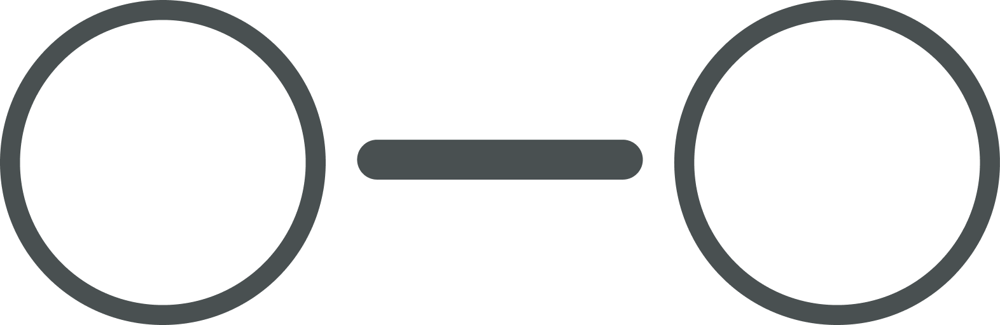
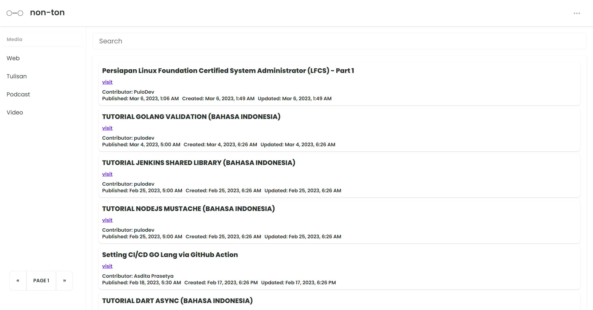

<a id="readme-top"></a>

<!-- PROJECT LOGO -->
<br />
<div align="center">
  <a href="#">
    
  </a>

  <h2 align="center">NON-TON</h2>

  <p align="center">
    <!-- <br />
    <a href="#"><strong>Explore the docs »</strong></a>
    <br />
    <br /> -->
    <a href="https://doi.vercel.app/auth/login">View Demo</a>
    ·
    <a href="#">Report Bug</a>
    ·
    <a href="#">Request Feature</a>
  </p>
</div>

<!-- TABLE OF CONTENTS -->

## Built With

<p align="left">
  <a href="https://skillicons.dev">
    
  </a>
</p>

<p align="right">(<a href="#readme-top">back to top</a>)</p>

<!-- ABOUT THE PROJECT -->
<!-- # About The Project  -->

## Features

### Home




<p align="right">(<a href="#readme-top">back to top</a>)</p>

## Installation

» Clone the repo

```sh
git clone https://github.com/muhahsanarifin/non-ton.git
```


<p align="center"> <samp><i>&copy; 2022-2023 non-ton</i></samp> </p>